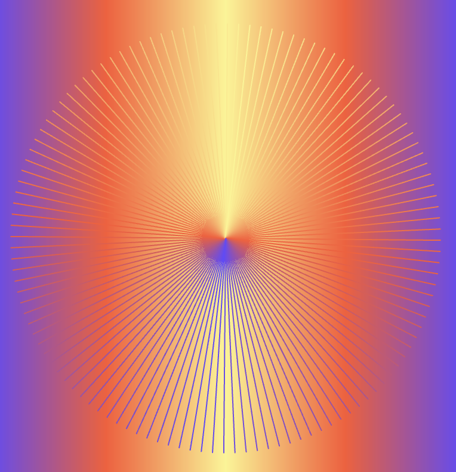
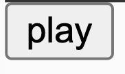

# Creative coding major project 

## **Part one: Instructions on how to interact with the work**

:books: :pencil2: **How to guide**: 

'Modern Dove' is an interactive animation created using p5.js. To interact with this artwork the user will neeed to load the page and the animation autonamtically starts. Next, press the play button on the bottom left hand corner for the music to start. The audio will match the animation of the dove that plays over 80 frames, roughly 11 seconds before repeating. Users will be able to enjoy the visual and auditory journey of my interpretation of daily journey of a flock of doves.

## **Part two: Individual approach**

:notes: For this individual component, I have choosen to use the content of three audio tracks to animate my work. Frame timing is also a significant factor that has been used to animate the backgkground and audio change. 

:girl: There are a few components of the artwork that are animated:

- Sun rays are featured in front of the gradient background, rotating slowly to create a sense of dynamic movement to compliment the flow of the doves. 

- The wings of the doves are programmed to move slowly as they travel across the sky using trigonometric function, more details in the technical explanation section. 

- The flock of doves move horizontally across the screen and loop back to the right side to create a continuous flow of movement to enhance realism. The doves vary in size and are masked by the three different backgrounds, sunrise to in the sky to the beach. 

The main difference between my animation compared to my group members is the use of audio, where as other members focused on mouse interaction with elements, time-based events and colour changes. 

:bulb: **Inspiration** 

| Image   | Explanation | Reference |
| :-----------: | :-----------: |:-----------: |
|       | I was inspired by the radiating lines in the shape of an ellipse and adapted this to represent my sun in my artwork.    |[Link here](https://editor.p5js.org/pattvira/sketches/mutDHiETf)  |
|       | Took inspiration from Coding Train's tutorial on how to create a play button for p5 JS. I like how it's simple, user-friendly and doesn't distract the viewer from the main artwork.   |[Link here](https://editor.p5js.org/codingtrain/sketches/3Z_lRpu2y)  |

:computer: :unlock: **Technical explanation** 

A few changes were made to the initial group code, this mainly consisted of: 

- Adding additional background images to the dove mask to align with the audio clips, creating a narrative. 
- Adding more doves of different sizes to create a more dynamic and interesting animation. 
- Gradient background to enhance visual depth and rotating sun ray to create a sense of movement. 

<mark style= "background: yellow" > Tools and techniques </mark> : 

- Audio synchronisation- I used an array to store the three songs and made sure that the frame count of the images matched to that of the song. 'If' statements were used to change the frame and audio every 80 frames as well a for the creation of the play button. The technique was storing the songs was learnt during class in the Week 10 and 11 tutorials. 

- Gradient background- To create the graident background, [lerpColor()](https://p5js.org/reference/p5/lerpColor/) was used to blend orange and pink together. A 'for' loop was used, taking into the account of the canvas height to create a seamless gradient effect. 

- Rotating rays- Drawing inspiration from [Patt Vira](https://editor.p5js.org/pattvira/sketches/mutDHiETf), I created 300 rays of length 550 and set the speed and angle properties. I then used a 'for loop' to get each ray to be evenly spaced and have them rotate at a slow speed. The 'push' and 'pop' method was used to transform the data. 

- Wing animation- To get the wings of the dove to move, [sin and cos](https://p5js.org/examples/angles-and-motion-sine-cosine/)functions were used to scale the movement with consideration fo the frame count of the images. 